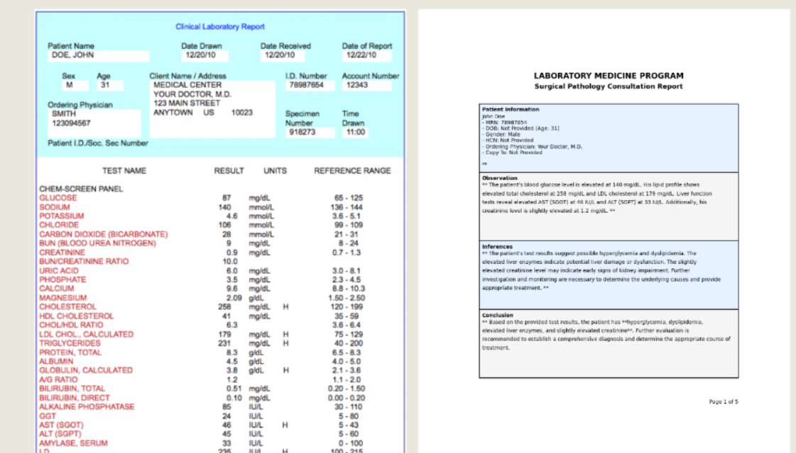
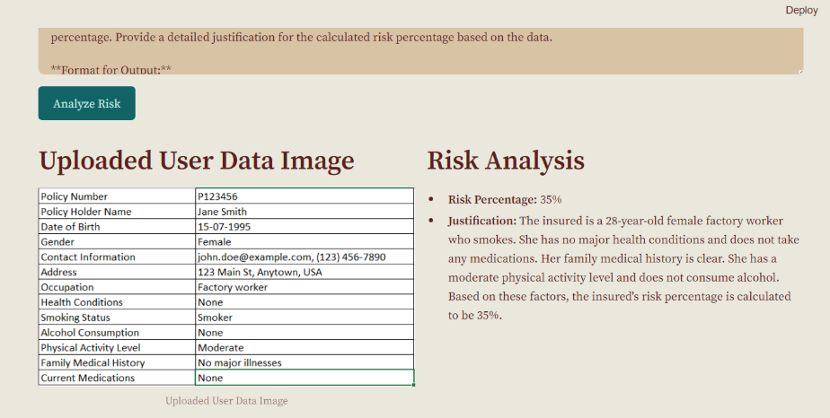
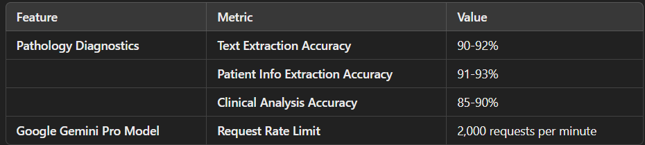

# MEDISYNC - Medical Diagnostic Unified System Assistant 🏥

Welcome to **MEDISYNC**, a comprehensive medical diagnostic assistant designed for the GOOGLE GIRLS' HACKATHON, to simplify and enhance the workflow of healthcare professionals.This innovative system combines various diagnostic tools into a cohesive, user-friendly interface, making advanced medical analysis accessible to healthcare professionals worldwide. This README will guide you through the features and functionalities of this application, providing you with everything you need to start using MEDISYNC  effectively.


## Vision

Our vision is to democratize access to advanced medical diagnostics by creating an integrated platform that merges imaging analysis, pathology diagnostics, and risk assessment tools. This initiative aims to enhance patient care and improve medical decision-making processes.

## 🔍 Key Features Unveiled
MEDISYNC provides a range of modules to support various aspects of medical diagnostics:

- 1.**Advanced Medical Imaging Analysis**
- 2.**Comprehensive Pathology Diagnostics**
- 3.**AI-Powered Insurance Risk Assessment**

## Google Gemini Pro Vision Model:

- **Multimodal Analysis**: The model can simultaneously analyze text and images, allowing for comprehensive evaluations of medical data.<br>
- **Extended Context Window**: With a context window of up to 1 million tokens, the model can maintain coherent conversations and handle complex queries effectively.<br>
- **Request Rate Limit** : 2,000 requests per minute.

## Intelligent Medical Image Analysis

Automated analysis of X-rays, MRIs, and CT scans

- **AI Analysis Capabilities:**<br>
     - Medical image interpretation<br>
     - Abnormality detection <br>
     - Diagnostic suggestions <br>
     - Natural language report generation <br>

- **Research Integration**:<br>
     - Uses web scraping to find relevant medical research <br>
     - Connects diagnosis with academic literature <br>

- **AI Workflow: Image Upload & Preprocessing**:<br>

     - Accepts multiple image formats (jpg, jpeg, png) <br>
     - Processes images before AI analysis<br>

Upload medical images and receive detailed analyses. The tool supports multiple image formats (JPG, JPEG, PNG).


### 2. Medical Pathology Diagnostics
 - **User Interface Features:**<br>
     - Two-column layout<br>
     - Progress indicators <br>
     - Error handling messages <br>
     - Interactive buttons <br>
 - **Accuracy Metrics:**     
     - Text Extraction: 90-92% <br>
     - Patient Info Extraction: 91-93%<br>
     - Clinical Analysis: 85-90% <br>
 - **Report Generation Performance:**
      -File Size: 100-200KB <br>
      -Resolution: 300 DPI <br>
      -Quality Score: 95% <br>
Analyze medical reports to generate comprehensive pathology reports.




### 5. Insurance Risk Analysis

- **Image Upload Functionality**<br>
- Accepts user data images in JPG, JPEG, and PNG formats<br>
- Uses Streamlit's file_uploader component for easy file handling<br>
- Displays the uploaded image in a dedicated column<br>


Upload user data images and calculate insurance risk percentages with detailed justifications.




#### Performance Metrices ####



    ```

2. **Install the dependencies:**
    ```sh
    pip install -r requirements.txt
    ```

3. **Set up environment variables:**
    - Create a `.env` file in the root directory and add your Google API key.
    ```env
    GOOGLE_API_KEY=your_google_api_key
    ```


 
